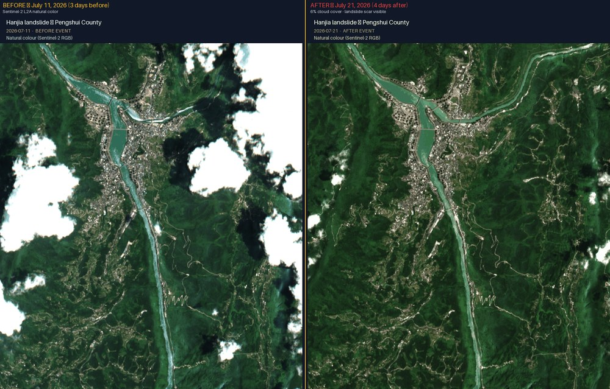
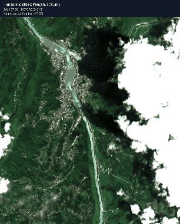
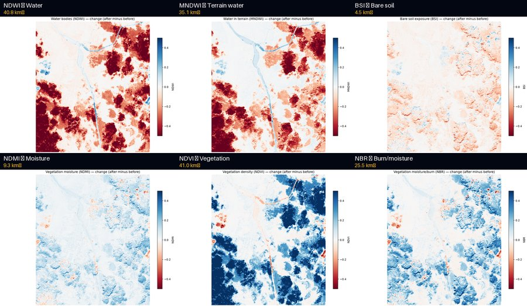

# Hanjia landslide — Pengshui County, Chongqing, China

On 17 July 2026 at 9:08 AM local time (01:08 UTC), a large rockslope failure
occurred on the banks of the Wujiang River at Hanjia, Pengshui Miao and Tujia
Autonomous County, Chongqing, China. The landslide buried over 10 residential
buildings, killing 51 people with 10 still missing.

**Event coordinates:** 29.27760°N, 108.16604°E

**Source:** [Reuters](https://www.reuters.com/world/asia-pacific/southwest-china-landslide-leaves-51-dead-10-missing-2026-07-30/),
[EOS Landslide Blog](https://eos.org/thelandslideblog/17-july-2026-landslide-at-hanjia-1)


## Results

### Before / After comparison



Left: **July 11** (3 days before landslide). Right: **July 21** (4 days after, 6% cloud cover).
The landslide scar and turbid river water are visible on the right panel.

### Animation (5 Sentinel-2 frames)



Cycles through July 8 → July 11 → July 16 (day before) → July 21 (4 days after) → July 26.
The landslide scar appears at frame 4 (July 21).

### Spectral index change maps



Six spectral indices, each showing after-minus-before change. Blue = increase, red = decrease.
NDVI and NDWI show the largest change signals (41 km² and 40.8 km² respectively).

### JSON report

The full structured report is in [`outputs/verification-report.json`](outputs/verification-report.json).

**Key findings:**
- Verdict: `change_detected`, confidence: `high`
- 1,595,341 changed pixels across 156.2 km²
- Pre-event scene from July 16 (the day before the landslide)
- Post-event scene from July 21 with only 6.4% cloud cover
- 6 spectral indices computed: NDWI, MNDWI, BSI, NDMI, NDVI, NBR
- SAR: no Sentinel-1 RTC scenes available (graceful optical-only fallback)

## Run it yourself

```bash
# Set your Tilebox API key
export TILEBOX_API_KEY="your-key-here"

# Submit the verification job
signal-verification-submit \
  --aoi aoi.geojson \
  --event-date 2026-07-17 \
  --title "Hanjia landslide — Pengshui County" \
  --description "Rockslope failure on Wujiang River, 51 dead, 10 missing" \
  --search-start 2026-06-01 \
  --search-end 2026-07-31 \
  --min-coverage 0.1 \
  --before-count 3 \
  --after-count 2
```

Outputs appear in `~/signal-verification-outputs/hanjia-landslide-pengshui-county/`.

Only credential needed: `TILEBOX_API_KEY`. No AWS, Copernicus, Microsoft, or
Element 84 credentials required.
